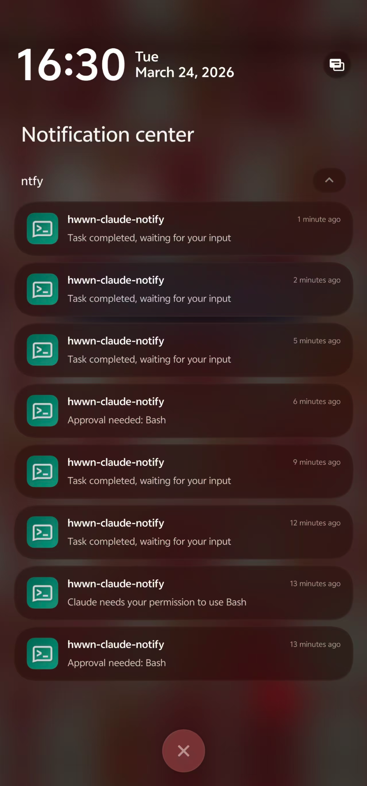
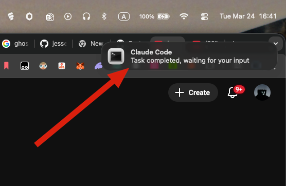

# claude-notify-everywhere

You kick off a Claude Code task. It's going to take a minute. So you step away — pour a coffee, hit the restroom, maybe even start cooking dinner.

Then your phone buzzes: **"Task completed, waiting for your input."**

You walk back, sit down, and pick up right where Claude left off. No staring at the terminal. No tab-switching every 30 seconds to check if it's done. Just... living your life, and getting pinged when it's your turn.

**claude-notify-everywhere** hooks into Claude Code and notifies you — on your Mac, on your phone, or both — whenever Claude finishes a task, needs permission, or wants your input.

<p align="center">
  
  <br />
  <em>Real-time Claude Code notifications on your phone via <a href="https://ntfy.sh">ntfy.sh</a> — free, no account needed</em>
</p>

<p align="center">
  
  <br />
  <em>macOS notification banner — click it to jump straight to your terminal (Ghostty, iTerm2, Warp, VS Code, etc.)</em>
</p>

## Features

- **Desktop notifications** with click-to-activate your terminal (Ghostty, iTerm2, Terminal.app, Warp, Alacritty, WezTerm, VS Code, Cursor, Claude Desktop)
- **Mobile push** via [ntfy.sh](https://ntfy.sh) (recommended — free & dead simple), Bark, Pushover, or Telegram
- **Sound alerts** — choose from 14 macOS system sounds, preview before you pick
- **Clean install/uninstall** — surgically adds/removes hooks from Claude Code settings
- **Zero background processes** — hooks are triggered by Claude Code itself

## Install

### Homebrew (recommended)

```bash
brew tap hwwn/claude-notify-everywhere
brew install claude-notify-everywhere
```

### Manual

```bash
git clone https://github.com/hwwn/claude-notify-everywhere.git
cd claude-notify-everywhere
# Ensure dependencies are installed
brew install jq terminal-notifier
# Add to PATH
ln -s "$(pwd)/bin/claude-notify-everywhere" /usr/local/bin/claude-notify-everywhere
```

## Setup

Run the interactive setup wizard:

```bash
claude-notify-everywhere install
```

This will guide you through:

1. **Terminal selection** — which app to activate when you click a notification
2. **Sound selection** — preview and pick a notification sound
3. **Mobile push** (optional) — set up phone notifications via your preferred provider

## Commands

| Command | Description |
|---------|-------------|
| `install` | Interactive setup wizard |
| `uninstall` | Remove all hooks from Claude Code settings |
| `config` | Re-run configuration (change terminal, sound, mobile) |
| `test` | Send a test notification to desktop and mobile |
| `status` | Show current configuration and hook status |

## How It Works

Claude Code supports [hooks](https://docs.anthropic.com/en/docs/claude-code/hooks) — commands that run at specific lifecycle events. This tool configures three hooks:

| Event | When | Notification |
|-------|------|-------------|
| **Stop** | Claude finishes and waits for input | "Task completed, waiting for your input" |
| **PermissionRequest** | Claude needs approval for an action | "Approval needed: {tool name}" |
| **Notification** | Claude sends a notification | The notification message content |

Hooks are stored in `~/.claude/settings.json`. Your preferences are stored separately in `~/.claude-notify-everywhere.json`.

## Mobile Push Providers

| Provider | Cost | Setup |
|----------|------|-------|
| [ntfy.sh](https://ntfy.sh) | Free | Install app → subscribe to a topic |
| [Bark](https://github.com/Finb/Bark) | Free | Install iOS app → copy push URL |
| [Pushover](https://pushover.net) | $5 one-time | Create account → get user key + API token |
| [Telegram](https://core.telegram.org/bots) | Free | Create bot via @BotFather → get token + chat ID |

## Uninstall

```bash
claude-notify-everywhere uninstall
```

This only removes the notification hooks from Claude Code settings. Your other settings remain untouched. To also remove the CLI:

```bash
brew uninstall claude-notify-everywhere
```

## License

MIT
